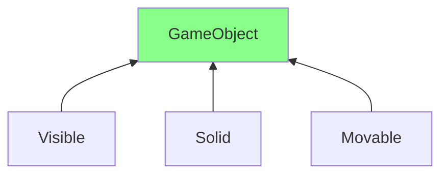

[TOC]

# Composition over Inheritance

- OOP principle that makes inheritance based on composition / behavior rather than inheritance from parent.




The C++ implementation would be like:

  ```c++
  class GameObject {
  	public:
      virtual ~GameObject() {}
      virtual void update() {}
      virtual void draw() {}
      virtual void collide(GameObject objs[]) {}
  };
  
  class Visible : public GameObject {
      public:
      void draw() override {};
  };
  
  class Solid : public GameObject {
      public:
      void collide(GameObject objs[]) override {}
  };
  
  class Movable: public GameObject {
      public:
      void update() override {}
  };
  
  ```

When we go and create a `GameObject` to have certain behaviors, we can flexibly select the component we want to inherit:

  ```c++
  class Player : public Visible, public Solid, public Movable {
      //...
  };
  
  class Building: public Visible, public Solid {
      //...
  }
  
  class Ghost: public Visible, public Movable {
      //...
  }
  ```